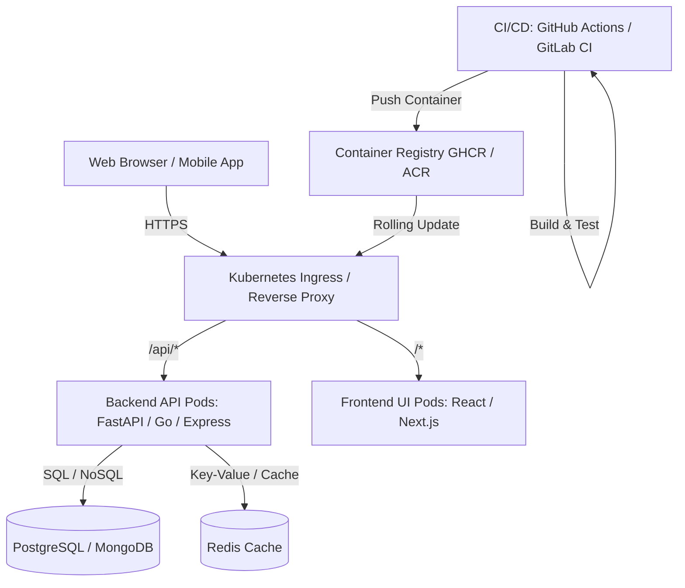

# ⚡ StackForge

[](https://pypi.org/project/stackforge-dev/)
[](https://www.npmjs.com/package/stackforge-dev)
[](https://opensource.org/licenses/MIT)
[](https://www.python.org/downloads/)
[](CODE_OF_CONDUCT.md)
[](CONTRIBUTING.md)

> **A production-grade, interactive terminal application that scaffolds modern cloud architectures, complete with microservice backends, frontends, databases, containerization, and multi-stage CI/CD pipelines.**
>
> Created by **Garvit Agarwal** • [Contributing](CONTRIBUTING.md) • [Code of Conduct](CODE_OF_CONDUCT.md) • [Security](SECURITY.md)

---

## 🌟 Key Highlights

- 🖥️ **Interactive Terminal TUI**: Guided step-by-step wizard powered by `rich` featuring cyberpunk, matrix, and nord color themes.
- ⚡ **Curated Architecture Presets**: Instant scaffolding of battle-tested stacks (FastAPI Cloud-Native, MERN, PERN, Go High-Throughput, Rust Axum, Next.js Enterprise, Spring Boot).
- 🛠️ **Deep CI/CD Pipeline Automation**: Fully articulated pipeline configurations for:
  - **GitHub Actions** (Lint, Multi-stage Test, Container Build & Push to GHCR, Trivy Security Scans, Kubernetes Rollout)
  - **GitLab CI/CD** (Multi-stage `.gitlab-ci.yml` with Docker-in-Docker and staging/prod gates)
  - **Azure DevOps** (`azure-pipelines.yml` with ACR and AKS integration)
  - **Jenkins** (Declarative `Jenkinsfile` with parallel testing stages and quality gates)
  - **CircleCI** (`.circleci/config.yml` with modern orbs and workflow triggers)
- 🐳 **Complete DevOps Infrastructure**:
  - Multi-stage production `Dockerfile`s
  - `docker-compose.yml` for unified local development (Hot-reload backend + frontend + DB + Redis cache)
  - `docker-compose.prod.yml` with resource limits and restart policies
  - Production **Kubernetes Manifests** (Deployments, ClusterIP Services, NGINX Ingress with TLS, ConfigMaps, Secrets, HPA)
  - **Helm Charts** (Parameterized `Chart.yaml`, `values.yaml`, templates, and helpers)
  - **Terraform IaC** (Cloud VPC, ECR repository, and resource definitions)
  - **Prometheus & Grafana** metrics scraping and dashboard templates
- 📋 **Developer Ergonomics**:
  - Auto-generated `Makefile` (`make dev`, `make test`, `make lint`, `make docker-up`, `make k8s-apply`)
  - Live in-terminal syntax-highlighted code previewer
  - ASCII directory tree generator
  - Config import/export (`stackforge.json`)

---

## 🚀 Quick Start

### Install from PyPI (pip)
```bash
pip install stackforge-dev

# Run from anywhere:
stackforge
```

### Install from npm
```bash
npm install -g stackforge-dev

# Run from anywhere:
stackforge
```

### Run from Source
```bash
# Direct run with Python
python run.py

# Or on Windows using batch script:
run.bat

# Or install in editable mode:
pip install -e .
stackforge
```

---

## 💻 CLI Usage & Commands

### Interactive Mode
Run without arguments to launch the step-by-step interactive wizard:
```bash
python run.py
```

### Curated Presets
List all available presets:
```bash
python run.py --list-presets
```

Generate a preset directly:
```bash
# FastAPI + PostgreSQL + Redis + GitLab CI + Kubernetes + Helm
python run.py --preset fastapi-cloud --name cloud-service

# MERN Stack + MongoDB + GitHub Actions + Docker
python run.py --preset mern-stack --name fullstack-web

# Go REST API + PostgreSQL + Docker + GitHub Actions
python run.py --preset go-high-throughput --name go-engine

# Rust Axum Microservice + Azure DevOps
python run.py --preset rust-axum-service --name rust-auth
```

### Headless Custom Generation (CLI Flags)
You can configure and scaffold any custom combination using flags:
```bash
python run.py \
  --name payment-gateway \
  --backend fastapi \
  --frontend react_vite \
  --db postgresql \
  --pipeline github_actions \
  --docker \
  --k8s \
  --helm \
  --terraform \
  --out ./payment-gateway
```

### Dry Run & Preview
Preview what files will be created and inspect pipeline code directly in the terminal without touching the disk:
```bash
python run.py --preset fastapi-cloud --dry-run --preview
```

---

## 📦 Supported Technologies Matrix

| Category | Supported Options |
| :--- | :--- |
| **Backend Frameworks** | FastAPI (Python), Express.js (TypeScript), NestJS (TS), Go (Gin), Rust (Axum), Django (Python), Spring Boot (Java 21) |
| **Frontend Frameworks** | React 18 + Vite (TypeScript), Next.js 14/15 App Router, Vue 3 + Vite, SvelteKit 2, None (Headless API) |
| **Databases & Cache** | PostgreSQL 16, MongoDB 7.0, Redis 7.2 (Cache/Queues), SQLite 3, MySQL 8.0, None |
| **CI/CD Pipelines** | GitHub Actions, GitLab CI/CD, Azure DevOps Pipelines, Jenkinsfile, CircleCI |
| **DevOps & IaC** | Docker, Docker Compose (Dev/Prod), Kubernetes, Helm Charts, Terraform AWS/GCP, Prometheus & Grafana |
| **Quality & Tooling** | Pytest, Jest, Go Test, Cargo Test, ESLint, Prettier, Pre-commit hooks, Makefiles |

---

## 🏛️ Architecture Blueprint Example



---

## 🧪 Running Automated Tests

A comprehensive unit test suite ensures that all blueprints, presets, and file generators produce valid configurations:
```bash
python -m unittest discover tests -v
```

---

## 📂 Project Structure

```
stackforge/
├── run.py                       # Quick CLI launcher
├── run.bat                      # Windows launcher batch script
├── setup.py                     # Package setup script
├── pyproject.toml               # PEP 621 package metadata & scripts
├── requirements.txt             # Python dependencies
├── README.md                    # Project documentation
├── stackforge/                  # Core application package
│   ├── __init__.py              # Package metadata
│   ├── __main__.py              # python -m stackforge entrypoint
│   ├── cli.py                   # Click CLI dispatcher & flag parser
│   ├── ui/
│   │   ├── banner.py            # ASCII logo, badges & section cards
│   │   ├── colors.py            # Rich terminal color themes
│   │   ├── wizard.py            # Interactive prompt wizard & menus
│   │   └── viewer.py            # File tree visualizer & syntax viewer
│   ├── core/
│   │   ├── config.py            # Configuration models & stack catalogs
│   │   ├── generator.py         # Scaffolding & file generation engine
│   │   └── validator.py         # Architecture rules & validation
│   ├── presets/
│   │   ├── __init__.py
│   │   └── default_presets.py   # Curated architecture presets
│   └── templates/               # Generation templates
│       ├── backend_templates.py # FastAPI, Express, Go, Rust, Spring
│       ├── frontend_templates.py# React, Next.js, Vue, SvelteKit
│       ├── database_templates.py# PostgreSQL, Mongo, Redis, SQLite
│       ├── pipeline_templates.py# GitHub Actions, GitLab, Azure, Jenkins
│       ├── devops_templates.py  # Docker, K8s, Helm, Terraform
│       └── tooling_templates.py # Makefile, README, .gitignore, .env
└── tests/                       # Unit & integration tests
    ├── test_config.py           # Config serialization tests
    ├── test_generator.py        # Template compiling & writing tests
    └── test_presets.py          # Preset validity & schema tests
```

---

## 🤝 Contributing

We welcome contributions from everyone! Check out our [Contributing Guide](CONTRIBUTING.md) to get started.

```bash
# Fork, clone, and set up for development
git clone https://github.com/<your-username>/stackforge.git
cd stackforge
python -m venv venv && source venv/bin/activate
pip install -e .
python -m unittest discover tests -v
```

See [CONTRIBUTING.md](CONTRIBUTING.md) for detailed guidelines on coding standards, commit messages, and the PR process.

## 🛡️ Security

Found a vulnerability? Please report it responsibly. See our [Security Policy](SECURITY.md) for details.

## 📜 License

This project is licensed under the **MIT License** — see the [LICENSE](LICENSE) file for details.

## 🌍 Community

- 📣 [GitHub Discussions](https://github.com/garvitagarwal9812/stackforge/discussions) — Ask questions, share ideas
- 🐛 [Issue Tracker](https://github.com/garvitagarwal9812/stackforge/issues) — Report bugs, request features
- 📖 [Code of Conduct](https://github.com/garvitagarwal9812/stackforge/blob/main/CODE_OF_CONDUCT.md) — Our community standards
- 📋 [Changelog](https://github.com/garvitagarwal9812/stackforge/blob/main/CHANGELOG.md) — What's new in each release

---

<p align="center">
  Made with ❤️ by <a href="https://github.com/garvitagarwal9812">Garvit Agarwal</a>
  <br>
  If you find StackForge useful, please ⭐ star the repo — it helps a lot!
</p>
